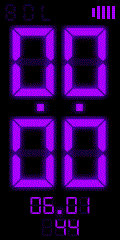
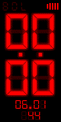

# Mi Band 4 Watchfaces and tools
Some watchfaces I modified or created. Amateur work, mostly.

Also including a folder for the [packing/unpacking tool](RawImageMode) and a [PNG optimizer](PngOptimizer) which should help lowering file sizes. 

The final .bin file should be at maximum 300 KB, the lower the value, the better.

When packing, the tool will convert all .png files to .bmp format at 32 bit, which should inflate the file size.

## Current faces:

### [Digital Lavender](digital_lavender)

[.bin file](digital_lavender/digital_lavender_packed_packed.bin) (232 KB)
- Bluetooth, Do Not Disturb & Lock indicators
- DD.MM format
- Heart rate measurement
- Battery indicator

### [Digital Red](digital_red)

[.bin file](digital_red/digital_red_packed.bin)  (224 KB)
- Bluetooth, Do Not Disturb & Lock indicators
- DD.MM format
- Heart rate measurement
- Battery indicator

## To Do:
- [ ] Optimize file sizes
- [ ] Add more color variants for the Digital face
- [ ] Find a way to add the day of the week on the Digital face
